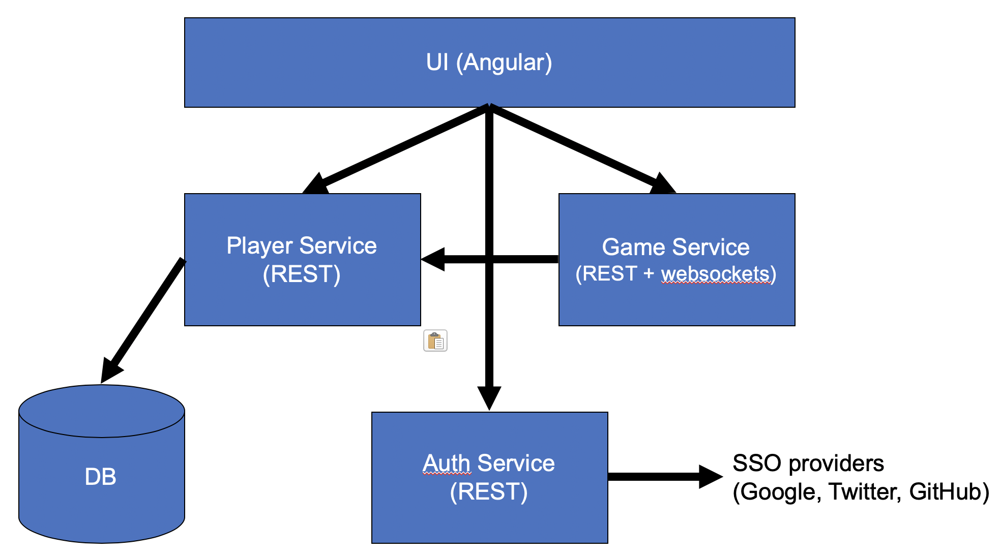

# liberty-bikes-ai

# Objective
In this lab you will write your own microservice for Liberty Bikes that uses OpenLiberty, Jakarta EE 8, and MicroProfile 3. Liberty Bikes is a real-time web-based multiplayer game that runs on Liberty and demonstrates a microservice architecture as well as the previously mentioned technologies.


Normally Liberty Bikes is played by a human looking at the screen and manually controlling the direction of their character. However, in this lab you will be coding your own AI microservice that will read the game board and make direction changes automatically. You will spend most of the lab running all of the services locally to build and test your AI service. At the end of the lab, the lab administrators will run the core Liberty Bikes services and the lab attendees (you) will run just your AI service and register it with the core Liberty Bikes services being hosted by the lab admins.


# 0) Prereqs

Required software:
- Have Java 8 or 11 installed, and `JAVA_HOME` set in your environment
- Have git installed
- Your preferred code editor

Fork and clone the [liberty-bikes repository](https://github.com/OpenLiberty/liberty-bikes) repository, then start up the Liberty Bikes core services by running the commands:

```
git clone git@github.com:OpenLiberty/liberty-bikes.git
cd liberty-bikes
./gradlew start
./gradlew stop
```

This will start and stop what we will refer to as the "core services".  The commands will also download a bunch of things such as gradle itself, maven dependencies, and the Liberty runtime. All of the command should complete successfully. If they do not, verify you have all of the prereqs software installed and then ask one of the lab admins for assistance.


Fork and clone the [liberty-bikes-ai repository](https://github.com/OpenLiberty/liberty-bikes-ai) with the commands:

```
git clone git@github.com:OpenLiberty/liberty-bikes-ai.git
```

# 1) Your first game

Before you start writing your AI service, let's begin by getting a basic understanding of what Liberty Bikes is on the surface and how it all works under the hood.

### How the game works:
- The game consists of rounds that typically last 20-60 seconds each
- Each round starts with up to 4 players in opposite corners of the map
- When the starting countdown reaches 0, players begin moving in whatever direction they are facing
- Players may use arrow keys (up/down/left/right) to change directions
- If a player runs into anything (a wall, the map border, a moving obstacle, another player's trail, or their own trail) they die
- The round continues until there is only 1 player alive
- The last player alive gets 1st place, the second to last player gets 2nd place, and so on. Points are awarded (or subtracted) based on what place you came in


### Running the core services:
The stuff in the main "liberty-bikes" repository contains the core services of Liberty Bikes. To start all of the core services on your laptop, run the `./gradlew start` command from the root of the liberty-bikes repository.


### To play your first game:
1. start all of the core services with `./gradlew start` if you haven't already
2. open the Liberty Bikes web UI by running the `./gradlew frontend:open` command, or open a web browser to http://localhost:12000  NOTE: It may be helpful to bookmark http://localhost:12000 for the duration of this lab
3. Press "Play as Guest"
4. Enter a username for your character, then "Sign in as Guest"
5. Press "play now". You should see a game board on the left and player status and scores on the right.
6. Use the arrow keys on your keyboard to change directions (if nothing is happening, make sure you have the web browser window in focus/selected)
7. Requeue into another game by pressing the "requeue" button at the bottom right of the screen after the round is over
8. After you requeue, you should see your stats updated on the right hand side
9. Close the browser tab when you are done


### To host your first game:
1. open a new browser tab, and go to the liberty bikes web ui
2. If you are logged in, log out
3. Press "Host round". You will see a game screen with 0 players in it and a timer countdown running
3. Open a new browser tab and go to the liberty bikes web ui
5. Sign in as a guest again. If you pressed "play now" while a round was in progress, you will be entered into the queue. If a round was not in progress, you will be entered into the next round.
6. Close out both browser tabs


### How it works:

The Liberty Bikes core services are comprised of 4 OpenLiberty servers, each running 1 microservice:
- frontend: Runs the Angular-based UI (features used: Servlet)
- game-service: Runs the core game engine and coordinates rounds. (features used: CDI, EE Concurrency, JAX-RS, JSON-B, MP Config, MP Rest Client, MP JWT, Websockets)
- player-service: Manages player registration and stats. (features used: CDI, JAX-RS, JSON-B, MP Config, JDBC)
- auth-service: Coordinates authentication and distributes JWTs (JSON Web Tokens) for other services. Can be set up to integrate with Google, Twitter, and Github SSO providers, but that will not be covered in this lab.

Liberty Bikes architecture:


To see technology highlights in the code, have a look at https://github.com/OpenLiberty/liberty-bikes#technologies-used, or just poke through the code (particularly in game-service and player-service).


# 2) Hello World!

> NOTE: For the remainder of this lab (except for section 5) you can leave the core services running on your machine. From this point forward you will be developing an app that runs in the 'liberty-bikes-ai' github repo that you cloned in section 0.

## Import the project
Using some sort of IDE (Eclipse, IntelliJ, or VS Code), import the 'liberty-bikes-ai' folder as an existing Gradle project.  Ensure that you have build automatically turned on, or remember to issue a rebuild of the project whenever you make a code change.

## Start your AI server and see the logs
In the root of the 'liberty-bikes-ai' repo, run `./gradlew start` to start up your AI server.
Next, open the server logs by going to `build/wlp/usr/servers/ai-service/logs/messages.log`. You will see content similar to this:

```
[AUDIT   ] CWWKE0001I: The server ai-service has been launched.
[AUDIT   ] CWWKZ0058I: Monitoring dropins for applications.
[AUDIT   ] CWWKT0016I: Web application available (default_host): http://localhost:8083/liberty-bikes-ai/
[AUDIT   ] CWWKZ0001I: Application liberty-bikes-ai started in 0.462 seconds.
[AUDIT   ] CWWKF0012I: The server installed the following features: [cdi-2.0, jaxrs-2.1, jaxrsClient-2.1, jndi-1.0, jsonb-1.0, jsonp-1.1, mpConfig-1.3, mpRestClient-1.3, servlet-4.0, websocket-1.1].
[AUDIT   ] CWWKF0011I: The ai-service server is ready to run a smarter planet. The ai-service server started in 1.385 seconds.
```
Leave this log file open for duration of this lab -- you will be referring to it frequently to see the output of your application.


## Hot code updates with OpenLiberty
A very nice feature of OpenLiberty is that for local development you don't need to restart your server or even redeploy your app between code changes. If you are using an IDE that compiles the app for you, the IDE recompiling the app will be detected by Liberty and it will automatically restart the app with the new code.
To test this out, go to the `org.libertybikes.ai.service.StartupProcedure` class and make any code change you like (as long as it compiles).
Once you save the code change and your IDE recompiles the app, refresh your messages.log file and you will see the app updated automatically in a few milliseconds:

```
[AUDIT   ] CWWKT0017I: Web application removed (default_host): http://localhost:8083/liberty-bikes-ai/
[AUDIT   ] CWWKZ0009I: The application liberty-bikes-ai has stopped successfully.
[AUDIT   ] CWWKT0016I: Web application available (default_host): http://localhost:8083/liberty-bikes-ai/
[AUDIT   ] CWWKZ0003I: The application liberty-bikes-ai updated in 0.152 seconds.
```

If you are not using an IDE that can recompile the app for you, you can manually trigger an application rebuild by running the command:

```
./gradlew war
```

## Starting the registration procedure at application startup time
When we start the server with our AI bot application, we don't want to have to manually initiate the registration procedure with the core services. Lets write a web listener that will automatically be invoked when the application is started. Update the `StartupProcedure` class to be the following:

```java
@WebListener
public class StartupProcedure implements ServletContextListener {

    @PostConstruct
    public void joinFirstRound() {
        System.out.println("Hello world!");
    }
}
```
When you save this code change, the app should restart again and you should see the "Hello world!" message in your messages.log

## If you get stuck (_only do this section if you get stuck_)

If you are stuck on any part of this lab and unable to make progress, please ask one of the lab admins for help.
As a backup, we have tagged several checkpoints along the lab. If you get stuck and just want to skip to the next section, you can do the following:

1. If you have registered your Bot key in `src/main/resources/META-INF/microprofile-config.properties` at this point, save it off to a file outside the lab repo. If you have not registered a Bot key yet, skip this step.
2. Stop your Bot server with the command: `./gradlew stop`
3. Wipe away all of your current changes with the command: `git checkout -- .`
4. Check out the next checkpoint branch with the command: `git checkout checkpoint-1` (or whatever checkpoint is next, checkpoint names are labelled in section headers)
5. Start your bot server with the command: `./gradlew start`


## Implementing the registration procedure [checkpoint-1]


First, update `StartupProcedure` to `@Inject` a `RegistrationBean` and call `joinRound()`. When you save the change, you should see print statements in your logs indicating `joinRound()` was invoked. Your code should now look something like this:

```java
@WebListener
public class StartupProcedure implements ServletContextListener {

    @Inject
    RegistrationBean regBean;

    @PostConstruct
    public void joinFirstRound() {
        regBean.joinRound();
    }
}
```

In order to register our AI Bot with the core services so it can play in games, we need to do two things:
get the current party ID from the core services
join the party queue so our bot waits its turn to play games, and can be notified when it's time to join a game


We can get the current party ID by invoking `GET http://<game-service-ip-port>/party/describe`.  The response will be a JSON with the format:

```
{
  "isSingleParty" : boolean,
  "partyId" : String
}
```


### Making REST calls with MicroProfile REST Client


Go to the `GameServiceClient` interface and add an interface method that represents the endpoint we want to invoke like so:

```java
@GET    
@Path("/party/describe")
@Produces(MediaType.APPLICATION_JSON)
public Map<String, Object> describe();
```

If you are familiar with JAX-RS, you will notice that this is the exact same signature and annotations that a JAX-RS method would have, but without the method body.
Next, we need to declare the base URI of this REST client. We can do this using the MP REST Client annotations on the interface:

```java
@Path("/")
@RegisterRestClient(baseUri = "http://localhost:8080", configKey = AIConfiguration.GAME_SERVICE_KEY)
public interface GameServiceClient {
```

When we run the game-service locally, its URI is http://localhost:8080, so we will default to using that with the `baseUri` attribute. The `configKey` attribute allows us to override the `baseUri` using MP Config, which we will do later on in section 5.


Now that we have our REST Client bean, we can inject it into the `RegistrationBean` and get the current round id. Update the `RegistrationBean` class to have the following code:

```java
// don't forget to add these 2 annotations!
@Inject
@RestClient
GameServiceClient gameService;

public void joinRound() {
    System.out.println("Attempting to register with game service...");

    String partyId = (String) gameService.describe().get("partyId");
    System.out.println("Found party id: " + partyId);
```

The nice thing about MicroProfile REST Client is that you don't need to worry about building HTTP requests or parsing the responses back. It is all handled for you once you define the REST API schema and what the URLs are. In the above code, when we invoke `gameService.describe()` it is actually making an HTTP request to `{baseUri}/{path}` as defined by the `@RegisterRestClient.baseUri` and `@Path` annotation values, which evaluates to http://localhost:8080/party/describe. The REST Client interface methods can also take in arguments that are annotated with JAX-RS `@PathParam` or `@QueryParam` annotations to build more complex URLs. \
When we invoke the `gameService.describe()` method, we get some JSON data back. MP Rest Client will also use JSON-B to automatically convert the JSON response to a Java class, in this case it converts from JSON --> `Map<String,Object>` for us, so we can directly call `Map.get(String key)` on the result.

After building this change you should see that a 4-character code was received like this: `Found party id: WDPW`.


### Re-queueing with JAX-RS Server Sent Events

Now that we know the party ID, we need to register our bot in the party queue. We can use JAX-RS Server Sent Events (SSE) to put ourselves into the queue for the party. Since only 4 people can play in a game at a time, this will ensure everyone waits their turn. By establishing an SSE request at `http://<game-service-ip-port>/party/{partyId}/queue?playerId={playerId}` the core services will put our bot in line for a game, and then asynchronously notify us when it's our turn to join a round.

In order to make this request, we need to know 1 more piece of information: our Bot player's ID. To get this, we need to go to the frontend for the core services we want to register with. Right now, that's http://localhost:12000/ (later it will be one of the lab admins IP address). Click the "Register Bot" button, enter a name for your bot, and then click "Register Bot" again to get your bot player's ID. Copy and paste the ID string into `src/main/resources/META-INF/microprofile-config.properties` as the value for `player_key`.

In the `AIConfiguration` class, add `@Inject` and `@ConfigProperty(name = "player_key")` to the `playerKey` field. This will cause the value from `microprofile-config.properties` to be injected into the field, which is nice because we don't need to add secret information to our codebase, and we can easily change or override the value later without needing to recompile or repackage the app later. The code will look like this:

```java
@Inject
@ConfigProperty(name = "player_key")
private String playerKey;
```

We also need to add the game-service URL to the `AIConfiguration` class, add the following annotations to the `gameServiceUrl` field:

```java
@Inject
@ConfigProperty(name = GAME_SERVICE_KEY + "/mp-rest/url", defaultValue = "http://localhost:8080")
private String gameServiceUrl;
```

To access the `AIConfiguration` from the `RegistrationBean`, add the `@Inject` annotation to the `RegistrationBean.config` field.

Now that our player ID is configured, we can make the JAX-RS SSE request. Add the following code to the end of the `RegistrationBean.joinRound()` method:

```java
SseEventSource source = SseEventSource.target(target).build();  
source.register(inboundEvent -> processInboundEvent(inboundEvent, source),      
                errEvent -> errEvent.printStackTrace(), 
                () -> System.out.println("Closing SSE source for " + targetStr));       
source.open();
```
This code will make an HTTP request to the game-server with the URL discussed above. Here our AI Bot app is acting as the client to the SSE request, so it doesn't need to constantly poll the game-service to see what position in the queue it is -- the server will send the event when it wants to update clients. Most of the magic happens in the `SseEventSource.register()` method, which will set up callbacks for inbound events, error events, and the close event respectively.


#### Verify your progress

At this point, save any code changes you've made to trigger an app update. If you check your `messages.log` you should see some JSON messages coming through from the game-server. Also, you can go to http://localhost:12000 and select "host game". You should see your bot player in the game! It will just go straight and crash and probably get last place, but we will make it smart later. When the game is over your host view should automatically requeue to the next round, and so should your bot. 


# 3) Lets get moving [checkpoint-2]

At this point your AI bot will automatically join games when your application starts, and it when a game is over it will move itself to the next round. But, it's not a very good player yet. The next step we need to do is try to make some moves on the game board.

If you check your server logs, you will see a bunch of messages like `got json: <bunch of json data>`. This data is being sent from the game-service every "tick" (50ms increments of time) of the game, which represents the state of the game board. We can use this data to render our own understanding of the current game board, and try to make decisions on which way our bot should move.

### Sending and receiving messages with Websockets

First, we will cover making our bot change directions. If you look at the `AIWebsocket` class you will see a few annotated methods: `onOpen()`, `onMessage()`, and `onClose()`, which are invoked whenever the websocket is opened, receives a message, or closed, respectively. The `onMessage()` method only does one thing right now, and that is initiating the requeue procedure whenever a `FINISHED` message is received from the game-service. In the `else` block of that method, we can respond to game ticks using the `sendDirection(DIRECTION)` method, which will send a response over the websocket indicating which way our Bot should go. 


To make your Bot change directions, add a simple tick counter (i.e. count the number of times `onMessage()` is called) and send a message `DOWN` once every 10 ticks, otherwise go `RIGHT`. To be more efficient, track which direction your Bot is currently facing and only call `sendDirection()` if your Bot's direction has changed.


#### Verify your progress
Save your changes to trigger an app update. You should see your Bot changing directions about once every 500ms.

### Modelling JSON data with JSON-B

Now we will make sense of the JSON data coming from the game-service using JSON-B. There are 3 empty classes in the `org.libertybikes.ai.model` package for you to fill out. Each class has the JSON schema documented in it. JSON-B allows us to model JSON data with Java objects, an easy convert back and forth between JSON and POJO (plain old java object). For example, suppose we have the following JSON data representing a dog:

```
{ 
  "name": "Buddy",
  "age": 5,
  "bites": false
  "favoriteToys": [ "stick", "tennis ball", "bone" ]
}
```

We can model this JSON data as a Java class like this:

```java
public class Dog {
  public String name;
  public int age;
  public boolean bites;
  public List<String> favoriteToys;
}
```

Then, we can convert from JSON data <--> POJO like this:

```java
String json = // ...
Dog buddy = jsonb.fromJson(json, Dog.class);
String afterJson = jsonb.toJson(buddy);
```

Some other relevant aspects of JSON-B are:
- If an unrecognized property is found in the JSON data (i.e. it has no matching Java property) it is ignored
- By default, java fields that did not get matched to incoming JSON data are left as `null`
- By default, JSON-B only maps to public fields or getter/setter methods. Non-public members are ignored
- By default, the java objects must have a default (no-args) constructor.

Using this information, try to model the JSON data as POJOs in your app. \
If you get stuck, there is more information at: http://json-b.net/docs/user-guide.html#default-mapping \
Or if you really get stuck, the answers can be found here: https://github.com/OpenLiberty/liberty-bikes-ai/tree/checkpoint-3/src/main/java/org/libertybikes/ai/model


# 4) Code, Play, Repeat [checkpoint-3]

Now that you've modeled your JSON data with Java objects, you can pass these objects to your `AILogic` and finally make some informed decisions on where to steer your bot! Be warned, there are a few different types of messages that the game-service will broadcast -- not all of them are game ticks! You will need to account for this when passing a `GameTick` to your `AILogic` class somehow in the `AIWebSocket.onMessage()` method:

```java
    } else {
        // use jsonb to convert from String --> POJO
        GameTick gameTick = jsonb.fromJson(message, GameTick.class);
        boolean isValid = // determine if the current JSON is a valid GameTick or some other message
        if (isValid)
            sendDirection(aiLogic.processAiMove(gameTick));
    }
```

The `AILogic` class can house any of the... AI logic... that you want to use to control your bot. Feel free to create additional methods and classes at this point if it would be helpful -- this is essentially the end of the lab and you can do put as much or as little effort as you'd like into making your AI Bot. Perhaps think of some algorithms that you could use to steer your bot. For example, here are a few basic algorithms:
- Go straight until you are about to run into something, then turn left or right (relative to bot's current direction)
- At each game tick "look" in each direction -- forward, left, and right. Compute which direction you can go in a straight line for the longest, and go that way.

# 5) Let's Get Ready to Rumble!!!

Towards the end of the lab we will host a competition where everyone can battle their AI bots against each other to see who has the best one! In order to do this, you will run just your AI bot on your laptop. You may now shutdown the core services running on your laptop by running `./gradlew stop` from the root of the liberty-bikes repo.

The lab admins should be running a set of core services on their laptops, and will provde you with their IP address. We will call it `$ADMIN_IP` in these instructions.

In order to configure your bot to connect to the lab admins set of core services, you must do the following:
1. Go to their frontend at `http://$ADMIN_IP:12000` and register your bot and take note of the generated key like you did at the end of section 2
2. Stop your bot server using `./gradlew stop`
3. Update `src/main/resources/META-INF/microprofile-config.properties` with your new bot key
4. Also in the `microprofile-config.properties` file, uncomment the `GAME_SERVICE_URL/mp-rest/url` key, and update its value with `$ADMIN_IP`, for example `http://9.10.11.12:8080`
5. Start your bot server using `./gradlew start`. You should see in your server logs that it is now connecting successfully to the lab admin's game-service instance.